
Fernerkundung in der Landschaftsplanung - Tag 2 - SNAP

**Autoren:** Diese Übung wurde von **Dr. Anika Sieber**, FU Berlin entwickelt. Für die Verwendung an der BOKU wurden von Fabian Fassnacht kleinere Anpassungen durchgeführt. 

## 2 Einstieg in SNAP

### Allgemeine Hinweise

• Lesen Sie sich dieses Handout ausführlich bis zum Ende durch, **bevor Sie mit der Übung beginnen**! Sehr häufig klären sich Ihre aufkommenden Fragen in den nächsten Arbeitsschritten!

•Legen Sie sich einen Arbeitsordner an, in dem Sie alle zukünftigen Daten für unseren Fernerkundungskurs speichern. Wir empfehlen, diesen Ordner z.B.  **FE_Kurs** zu nennen und in diesem weitere Unterordner für jede einzelne Sitzung anzulegen (z.B. **…\FE_Kurs\02_SNAP** für die heutige Sitzung).

Wichtig für alle Sitzungen: Bitte achten Sie auf die korrekte Benennung Ihrer Ordnernamen:

 - Erlaubt sind: Zahlen, gängige Buchstaben sowie Unterstriche.
 - Verzichten Sie unbedingt auf: Umlaute, Leerzeichen und Sonderzeichen!

**Daten:**

• Komprimierter Datensatz Sentinel_2_Wien.zip (mit 2 Dateien, die die 12 einzelnen Sentinel-2-Spektralkanäle einer Sentinel-2-Szene aus dem März 2026 enthalten)

• Wir stellen Ihnen diese Daten in einem komprimierten Datenformat  auf BOKUlearn zur Verfügung.

▪ Bitte kopieren und speichern Sie die Daten in Ihrem eigenen Ordner 

▪ Anschließend können Sie die Daten entpacken. 

### 2.1 Lernziele

• Kennenlernen der SNAP-Benutzeroberfläche
• Laden von Rasterdaten
• Räumliche Orientierung im Sentinel-2-Satellitenbild
• Kennenlernen verschiedener Spektralkanäle/Bänder und Abrufen von Pixelwerten für verschiedene Landbedeckungen
• Vergleichende Darstellung

### 2.2 Start und Öffnen von Rasterdaten

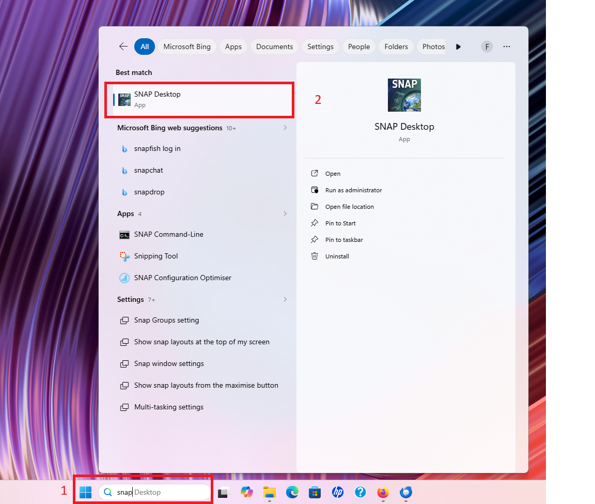

**Abbildung 1: Starten von ESA SNAP im Startmenü**

• Starten Sie SNAP unter Start > ESA SNAP > SNAP Desktop. Alternativ doppelklicken sie das Desktop Symbol.

Das Hauptfenster des Programms mit den Menüpunkten FILE, EDIT, VIEW, … und HELP öffnet sich.

• Laden Sie den auf BOKUlearn zur Verfügung gestellten Datensatz **subset_0_of_S2A_MSIL1C_20260314T095051_N0512_R079_T33UWP_20260314T132917.dim** in den SNAP Viewer via **FILE > OPEN PRODUCT**.

HINWEIS: Darauf achten, dass Sie im neuen Fenster unter Files of type > All Files wählen (falls die Datei im Ordner nicht auffindbar sein sollte).

• Öffnen Sie nun den zweiten Spektralkanal (B2), indem Sie mit einem Doppelklick auf der linken Seite im Product Explorer > Bands > B2 auswählen.

• Alternativ können Sie einen Rechtsklick auf das B2 machen und "Open Image Window" wählen.

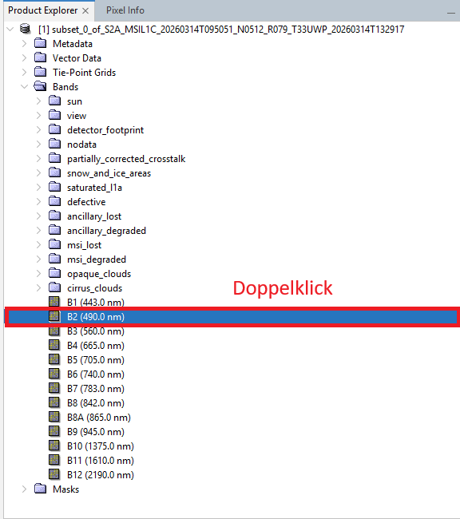

**Abbildung 2: Laden von Band 2 des Sentinel-2 Satellitenbildes**

- Welcher Bereich des Lichts wird im Kanal B2 dargestellt? (TIPP: siehe Hausaufgabe 1)
- Was sehen Sie in diesem Ausschnitt?

### 2.3 Räumliches Orientieren und Navigieren im Satellitenbild

So funktioniert’s:

• Fenster links unten: via World View kann der Ausschnitt des verfügbaren Satellitenbildes in der Weltansicht dargestellt werden (markiert mit 2 in Abbildung 3)

• Mit Hilfe der Toolbar (oben, unterhalb der Menüleiste) können Sie nun im Satellitenbild navigieren:

- Panning tool: Verschieben des Bildausschnittes (markiert mit 1 in Abbildung 3)

- Zooming tool: Zoomen (oder auch das Mausrad dafür verwenden) (markiert mit 1 in Abbildung 3)
- 
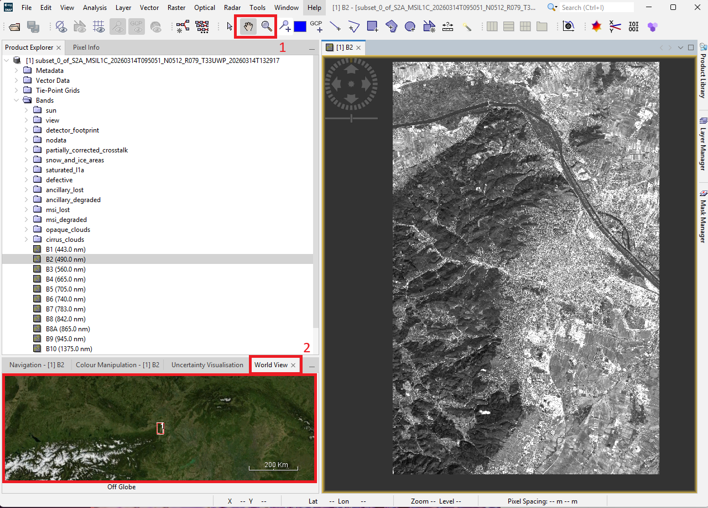

**Abbildung 3: Navigation in SNAP**

**Aufgabe: Identifizieren Sie folgende Orte/Geoobjekte im Satellitenbild:**

• Ihr Wohnhaus
• Prater
• Schloss Belvedere
• Parlament
• BOKU Campus Türkenschanze

Welche Herausforderungen stellen sich dabei allgemein sowie im Unterschied zum Seminar der letzten Woche (Arbeit mit Google Earth)?

### 2.4 Anzeigen der Pixelwerte

Neben der räumlichen Orientierung ist es natürlich wichtig zu erfahren, welche Werte in jedem Pixel der Satellitenszene enthalten sind.

Tool: Pixel Info (z.B. Suche via Search rechts oben in SNAP)

• Via Selection tool (siehe Toolbar) können einzelne Pixel ausgewählt werden (markiert mit 1 in Abbildung 4). 

• In der Pixel Info wird unter „Bands“ der im Pixel enthaltene Wert für den geladenen Spektralkanal (hier: B2) angezeigt (markiert mit 2 in Abbildung 4).

• Die rechte Spalte zeigt die Einheit an, hier: dl = dimensionless.

⇒  Der angegebene Pixelwert stellt den Reflexionsgrad (auch Reflektanz, engl. reflectance) dar.

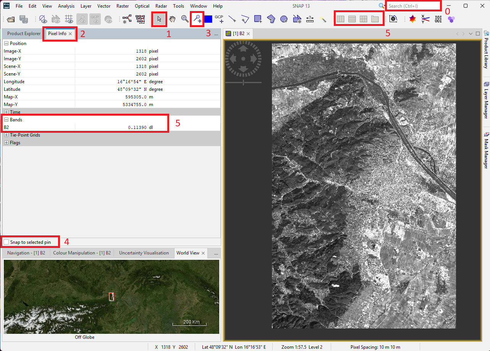

**Abbildung 4: Anzeigen von Pixelwerten**

Aufgabe: Suchen Sie nun beispielhafte Pixelwerte für den Spektralkanal B2 und den Spektralkanal B8 für die folgenden Landbedeckungen/ Landnutzungen heraus und notieren Sie sich diese (siehe Tabelle in Abbildung 5).

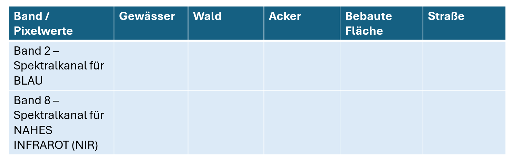

**Abbildung 5: Übersicht über die zu extrahierenden Pixelwerte**

• **TIPP 1:** Öffnen Sie auch den Spektralkanal B8 im Product Explorer mit einem Doppelklick.

• **TIPP 2**: Sie können sich beide Spektralkanäle auch parallel ansehen:
 Wählen Sie dafür in der Toolbar Tile Horizontally aus (markiert mit 5 in Abbildung 4).
 Die beiden parallelen Views können dann synchronisiert werden via (Menüleiste) VIEW > SYNCHRONIZE IMAGE VIEWS.

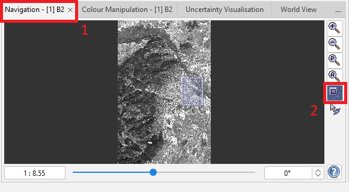

**Abbildung 6: Synchronisation der Visualisierungen einzelner Ansichten**

• **TIPP 3**: Sie können dafür das Pin Placing Tool (markiert mit 3 in Abbildung 4)) verwenden und an den gewünschten Stellen einen Pin platzieren. Um die Pixelwerte der einzelnen Pins ablesen zu können, klicken Sie mit dem Selection Tool Ihren Pin an (er ist dann gelb markiert) und setzen Sie im Pixel Info-Fenster das Häkchen für Snap to selected pin (markiert mit 4 in Abbildung 4)). Sie können so für ein und dasselbe Pixel die Werte von mehreren Spektralkanälen ablesen.

### 2.5 Farbdarstellung
Bisher haben Sie sich die Spektralkanäle einzeln und in Graustufen ansehen können. Um Ihr Satellitenbild auch in Farbe sehen zu können, müssen mehrere Spektralkanäle miteinander kombiniert werden. Das ist in SNAP über ein Tool möglich, das für die 3 verschiedenen „Farbkanonen“ (Rot, Grün, Blau) am Bildschirm die jeweiligen Spektralkanäle der Sentinal-2-Szene auswählt.

Wichtig: Ihr Bildschirm kann nur die Farben Rot, Grün und Blau über die sogenannten „Farbkanonen“ mischen. Deshalb können auch nur maximal drei Spektralkanäle Ihres mehrkanaligen Datensatzes gleichzeitig dargestellt werden. Additive Farbmischung! Für die Farbdarstellung am Monitor können Sie die Spektralkanäle Ihres mehrkanaligen Datensatzes frei kombinieren – Sie müssen nur jeweils einen Spektralkanal auf eine Monitor-Farbkanone „legen“.

Wir wollen uns die Sentinel-2-Szene zuerst in einer Echtfarbdarstellung ansehen, danach in einer Falschfarbdarstellung.

#### 2.5.1 Echtfarbdarstellung
Aufgabe: Öffnen Sie ein sogenanntes Echtfarbkomposit in SNAP.

So funktioniert’s:

• Rechtsklick auf den Datensatz im Product Explorer > Open RGB Image Window (Abbildung 7)

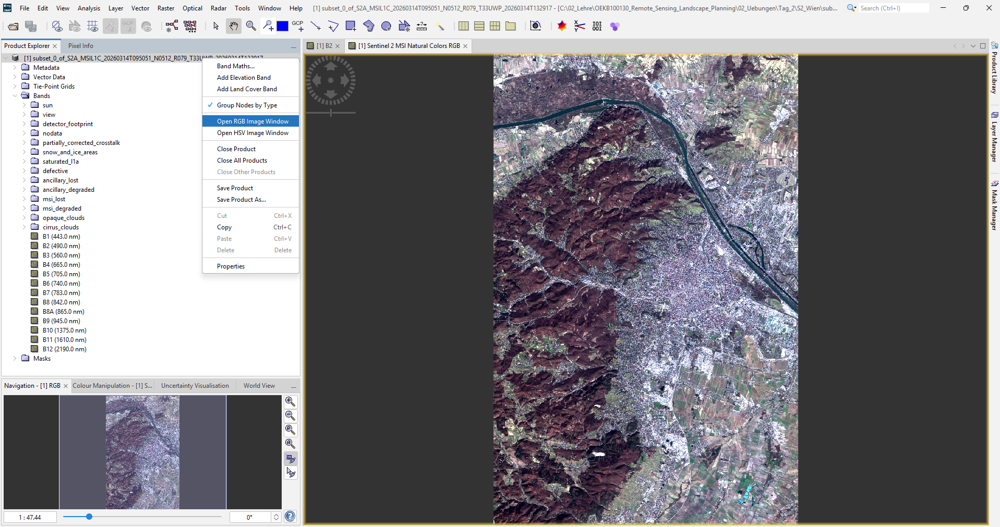

**Abbildung 7: Aufrufen der Echtfarbendarstellung in SNAP**

• Es öffnet sich folgendes Fenster (Abbildung 8):
- Sentinel 2 MSI Natural Colors => entspricht der Echtfarbdarstellung
- hier kann die rote Farbkanone (R) Ihres Bildschirms angesprochen werden
- hier kann die grüne Farbkanone (G) Ihres Bildschirms angesprochen werden
- hier kann die blaue Farbkanone (B) Ihres Bildschirms angesprochen werden

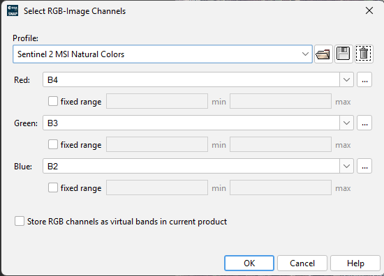

**Abbildung 8: Echtfarbendarstellung in SNAP**

• Überprüfen Sie, ob die ausgewählten Spektralkanäle (hier B4, B3 und B2) den notwendigen Spektralbereichen des Lichts entsprechen (Red = Spektralkanal für Rotes Licht, Green = Spektralkanal für Grünes Licht, Blue = Spektralkanal für Blaues Licht; TIPP: siehe Hausaufgabe 1).

• Passen Sie die ausgewählten Spektralkanäle ggf. an und klicken Sie auf „OK“.

• Es öffnet sich ein neuer Viewer mit dem Namen „Sentinel 2 MSI Natural Colors RGB“.

#### 2.5.2 Falschfarbdarstellung
Neben den Echtfarbkompositen werden in der Fernerkundung und allgemein bei der Arbeit mit Satellitendaten gern Falschfarbkomposite verwendet. Hier werden Kanalkombinationen gewählt, die nicht unserem gewohnten Sehen in Rot-Grün-Blau entsprechen.

Falschfarbkomposite haben den Vorteil, dass wir auch die Spektralkanäle visualisieren können, deren Spektralbereiche wir Menschen natürlicherweise nicht sehen können. Diese für uns nicht sichtbaren Spektralbereiche, z.B. das Nahe Infrarot, haben aber eine herausragende Bedeutung in vielen Anwendungsbereichen, z.B. bei Arbeiten zur Vegetationsvitalität.

Aufgabe: Stellen Sie ein Falschfarbkomposit dar.

So funktioniert’s:

• Rechtsklick auf den Datensatz im Product Explorer > Open RGB Image Window

• Unter Profile > False-color Infrared RGB auswählen.

- Welche Spektralkanäle werden ausgewählt?

- Welchen Wellenlängenbereichen des Lichts entsprechen diese (siehe Hausaufgabe 1)?

### 2.6 Export des Bildes als GeoTIFF

Als letzten Schritt des SNAP-Tutorials werden wir das Satellitenbild nun noch als GeoTiff exportieren. Die Standart-Vorgehensweise für diesen Schritt ist in Abbildung 10 dargestellt. Wir müssen hierfür zuerst das Bild welches wir exportieren wollen im "Product Explorer"-Fenster anwählen und dann **"File -> Export -> GeoTiff / BigTiff"**

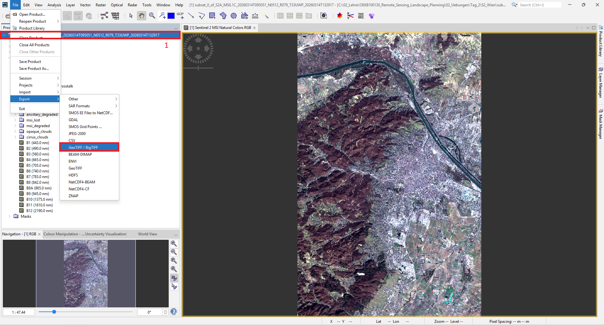

**Abbildung 9: Export Satellitenbild zu GeoTiff in SNAP**

In unserem Fall, führt dies zu einer Fehlermeldung (siehe Abbildung 10). Diese Fehlermeldung erscheint, da unser aktuelles Satellitenbild aus Bändern mit verschiedenen räumlichen Auflösungen besteht. Wir ihr in eurer Hausaufgabe 1 bereits recherchiert hattet, gibt es bei Sentinel-2 bestimmte Bänder mit 10 m Pixelgröße, weitere mit 20 m Pixelgröße, und schließlich welche mit 60 m Pixelgröße. Eine Geotiff-Datei kann hiermir nicht umgehen und erwartet ein Bild in dem alle Bänder dieselbe Pixelgröße haben. 

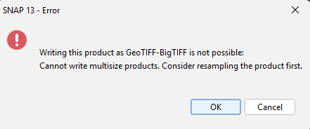

**Abbildung 10: Fehlermeldung - Export nicht möglich**

Um den Export dennoch zu ermöglichen, werden wir nun zwei weitere Schritte implementieren:

1. Wir werden nur die Bänder mit 10 m und 20 m Pixelgröße beibehalten
2. Wir werden alle übriggebliebenen Bänder auf 10 m "resamplen" - d.h., für die Bänder mit 20 m Pixelgröße wird die räumliche Auflösung künstlich erhöht.

Für den ersten Schritt wählen wir im Product Explorer erneut das Satellitenbild an (falls nicht sowieso schon markiert) und wählen dann im Hauptmenü **"Raster -> Subset"**. Im nun erscheinenden Fenster wählen wir zuerst den Reiter **Band Subset** (markiert mit 1 in Abbildung 11). Hier selektieren wir zuerst **Select None** (markiert mit 2 in Abbildung 11) und danach wählen wir manuell alle Bänder aus, die entweder 10 m oder 20 m Pixelgröße haben (siehe Abbildung 11). Wir bestätigen mit **OK**.

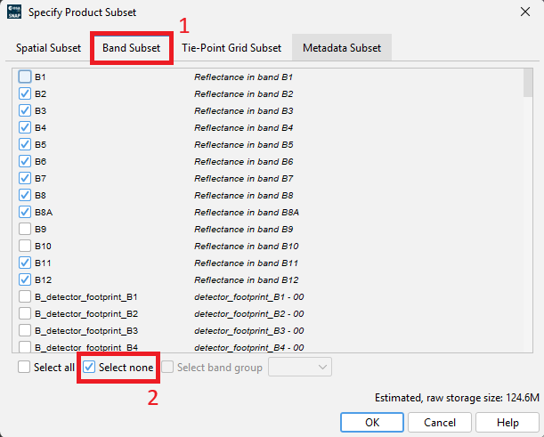

**Abbildung 11: Erstellung eines Band-Subsets in SNAP**

Daraufhin erscheint sofort ein neues Produkt in der **"Product Explorer"** Ansicht. Dies geschieht ohne Zeitverzögerung, da SNAP die eigentliche Erstellung des Subsets noch nicht durchführt sondern nur die "Regel" abspeichert. Erst wenn das Satellitenbild gespeichert oder exportiert wird, wird die eigentliche Prozessierung durchgeführt.

Für den zweiten Schritt wählen wir das soeben erstelle neue Produkt an und wählen dann **Raster -> Geometric -> Resampling**. Im erscheinenden neuen Fenster wählen wir den Reiter **Resampling Parameters** (markiert mit 1 in Abbildung 12). Hier sehen wir verschiedene Auswahlmöglichkeiten wie wir das Resampling durchführen möchten. Für den aktuellen Fall sind die Einstellungen bereits in Ordnung so wie sie sind und wir bestätigen mit **OK**. Daraufhin erscheint wiederum ein neues Produkt im "Product Explorer".

**Abbildung 11: Erstellen eines Subsets in SNAP**

Wenn wir dieses neu erstelle Produkt jetzt anwählen und dann wiederum versuchen das Satellitenbild zu exportieren (siehe oben), sollte es funktionieren. Bitte speichern Sie das Bild mit dem Dateinamen "Sentinel_2_Wien_Maerz_2026.tif" in ihren Ordner. Das Bild werden wir kommende Woche in R weiterverwenden.

Das waren die Inhalte der zweiten Sitzung „Einführung in SNAP“.
Wenn Sie dieses Handout durchgearbeitet haben, haben Sie

✓ die Benutzeroberfläche von SNAP kennengelernt,
✓ sich damit beschäftigt, wie Sie in Ihrem Sentinel-2-Satellitenbild räumlich navigieren können,
✓ kennengelernt, wie einzelne Spektralkanäle in Rasterdatensätzen gespeichert sind,
✓ für unterschiedliche Wellenlängenbereiche Pixelwerte für verschiedene Landbedeckungen abgerufen und
✓ verschiedene Farbkomposite erstellt.
✓ Das Satellitenbild als Geotiff-Datei exportiert.

## HAUSAUFGABE

1) Zeigen Sie Ihre vollständig ausgefüllte Tabelle aus 2.4 mit den Sentinel-2 Pixelwerten der fünf Landbedeckungs- und Landnutzungstypen für die Spektralkanäle B2 und B8.

2) Zeigen Sie zwei vergleichende Screenshots auf einer Folie (A: Echtfarbkomposit, siehe 2.5.1, sowie B: Falschfarbkomposit, siehe 2.5.2) und geben Sie die jeweils dargestellte Kanalkombination an. Geben Sie bitte stichpunktartig an, welche Landnutzung, Landbedeckung oder Eigenschaft in der Falschfarbdarstellung im Vergleich zum Echtfarbkomposit besonders gut identifiziert werden kann.

3) Sie erhalten eine Tabelle mit den folgenden Reflektanzwerten, die aus einem Sentinel-2-Satellitenbild ausgelesen wurden (Abbildung 9).

**Abbildung 9: Tabelle mit Pixelwerten für RGB-Bänder**

In welcher Farbe werden die Pixel in einer Echtfarbdarstellung erscheinen? In Bereichen mit welcher Landbedeckung könnten die Pixel jeweils liegen?
	
Hinweis: Recherchieren Sie auf den Seminarfolien, welche Farbanteile des sichtbaren Lichts die Spektralkanäle jeweils abbilden.
Übertragen Sie die ausgefüllte Tabelle in Ihre Hausaufgabenpräsentation.

Speichern Sie Ihre kurze(!) Präsentation als PDF-Datei und benennen Sie diese folgendermaßen: Nachname_Vorname_HA2.pdf (z.B. für Max Mustermann - Mustermann_Max_HA2.pdf)
